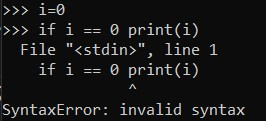
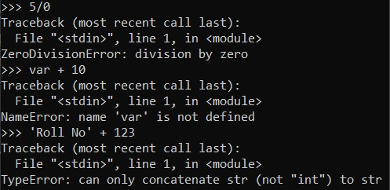
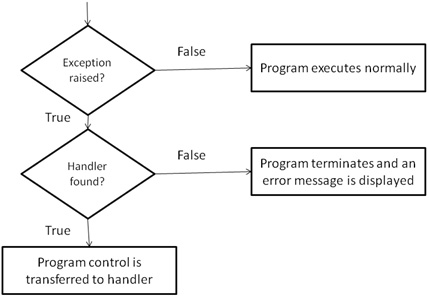
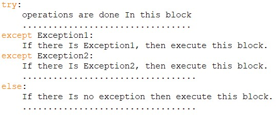

# Errors & Exceptions

## What are Errors?
Errors are the problems in a program due to which the program will stop the execution. They are almost always the fault of the programmer. The process of finding and eliminating errors is called debugging. Basically, there are two types of Errors:-
* Syntax Error
* Logical Error

### Syntax Error
Syntax errors occurs when we violate the rules of Python and they are the most common kind of error that we get while learning a new language. For example,

In the aforementioned code we have missed the ':' before the keyword print.

Common Python Syntax errors include:
* leaving out a keyword
* putting a keyword in the wrong place
* leaving out a symbol, such as a colon, comma or brackets
* misspelling a keyword
* incorrect indentation
* empty block

### Logic Error
Logical errors are the most difficult to fix. They may occur due to wrong algorithm or logic to solve a particular program. They occur when the program runs without crashing, but produces an incorrect result. You won’t get an error message, because no syntax or runtime error has occurred. You will have to find the problem on your own by reviewing all the relevant parts of your code – although some tools can flag suspicious code which looks like it could cause unexpected behaviour.

Here are some examples of mistakes which lead to logical errors:
* using the wrong variable name
* indenting a block to the wrong level
* using integer division instead of floating-point division
* getting operator precedence wrong
* making a mistake in a boolean expression
* off-by-one, and other numerical errors

## What are Exceptiions?
Even if a statement is syntactically correct, it may still cause an error when executed. Such errors that occur at run-time(or during execution) are known as exceptions. An exception is an event, which occurs during the execution of a program and disrupts the normal flow of the program's instructions. When a program encounters a situation which it cannot deal with, it raises an exception. Let us see some examples in which exceptions occurs.

## Handling Exceptions
We can handle exceptions in our program by using try block and except block. A critical operation which can raise exception is placed inside the try block and the code that handles exception is written in except block. The Syntax for try-except block can be given as:

The picture below shows you how the exception is handled in a program.

Now, let's take a look at an example to better understand how an exception is handled in a program.

The output of the aforementioned program is given below:

## Multiple Except Blocks
Pyhton allows you to have multiple except blocks for a single try block. The block which matches with the exception generated will get executed. A try block can be associated with more than one except block to specify handlers for different exceptions. However, only one handler will be executed. Exception handlers only handle exceptions that occur in the corresponding try block. The syntax for specifying multiple except blocks for a single try block can be given as,

Now, let's take a look at an example to better understand this.

The output of the aforementioned program is given below:

Note that after the execution of the except block, the program control goes to the first statement after the except block for that try block.

