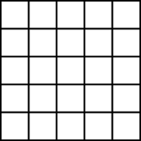
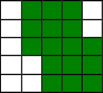
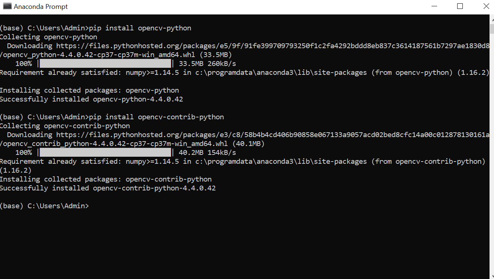

- **What is OpenCV?**
    
    Basically, OpenCV means **Open Source Computer Vision and Machine Learning Software** Library. As the name suggests, OpenCV has plays a major role in the field of *Computer Vision*. This is a highly optimized library that has enormous scope in *real-time applications*. The optimized algorithms which are more than 2500 in number have proved to be extremely useful in developing models of *Artificial Intelligence* and *Computer Vision*. Important aspect of OpenCV is that it's an *image processing* library that can *process* images, videos and even make use of webcams to *capture* images and videos.
- **OpenCV in Computer Vision:**
  
  **Computer Vision** is a scientific field that helps the computer to access and process digital images and videos as if it can "**see**". *Main goal* of Computer Vision is to provide the computer systems the capacity to *interpret and understand* digital images and videos at a higher level and even react to what they *see*.
  
- **Images**:

  Images are nothing but collection of *pixels*. Different values are assigned to each pixel in the image that determines its *color*. To clearly understand the concept of images, consider a *5X5 grid* that has 5 rows and 5 columns as below:
  
  
  
  If each of the rows is numbered from 1 to 5 and each of the columns is also numbered from 1 to 5, then **the color of individual blocks (i,j)** where *i represents row number and j represents column number*, can be changed that makes the grid colorful. Similarly, *pixels* of the image are assigned values to determine their colors, hence resulting in the desired image.
  
  
  
  The above image shows how some of the blocks are assigned the color "Green" to make the grid appear different. **This simpler tactic is applied in creating and processing images**. OpenCV basically processes the images by *acquiring the information of each pixel in the image and modifying it as per the requirement*. The idea behind accessing and processing videos remains the same since *videos are nothing but a sequence of images*. The quality of an image depends on the *resolution* where as quality of a video depends on the *number of frames per second*.

- **What is the importance of Image Processing and why OpenCV?**

    In modern technical world, with the advancement of technology, digital data in the form of images is of utmost importance as data can be sent and received, stored and retrieved in this format. "Encryption" is of huge interest and importance nowadays for various reasons like security and privacy. Encrypting data in images is most common. This states the importance of image processing in modern era.
    
    Coming to image processing, OpenCV is the best library to achieve it since it allows both image and video processing. Along with these, it allows to capture shots from videos and thus, obtain images from videos. It is easily understandable which is one of the avantages for beginners in Computer Vision and image processing. OpenCV also facilitates Denoising of noisy image and Histogram Equalization. 

- **Installation of OpenCV**:
    *This section describes the installation process of OpenCV in the **Conda environment***. Installation of OpenCV requires execution of 2 commands in the *Anaconda Prompt*.
    - **Open** the *Anaconda Prompt* on the system.
    
    - **Execute** the following commands:
    
        pip install opencv-python
        
        pip install opencv-contrib-python
        
    **A snapshot of the installation is attached below:**
    
    
    
    
    After the installation, for further projects, OpenCV can be imported on the IDE using the following statement:
        import cv2
    This means, in any python script that you use OpenCV for image and video processing, it is mandatory to include the above statement in order to import the OpenCV library and use it's functions.
 - **Basic functions in OpenCV**:
    - ***imread()***:
        
        Looking into the basic functions in OpenCV, the first function is the *imread()* function. This function is used to load an image to a variable that can be used for further processing. 
        
        *Syntax*:
        
            variable_name = cv2.imread(location_of_the_image_to_be_loaded/name_of_the_image_to_be_loaded_with_its_extension)
            
         *Example*:
         
            img = cv2.imread("/Users/Admin/Desktop/Images/my_img.png")
            
         The above statement loads the image "**my_img.png**" in the path "**Users/Admin/Desktop/Images**" into the variable ***img***.
         
     - ***imshow()***:
     
        Displaying the loaded image is an important requirement to the users. To ensure that, the OpenCV library has an in-built function, imshow().
        
        *Syntax*:
        
            cv2.imshow(window_name , variable_name)
            
         ***OR***
            
            cv2.imshow(window_name , location_of_source_image)
            
         *Example*:
         
            cv2.imshow("Output_Image" , img)
            
         The above statement displays the image that is already loaded into the "***img***" variable on the new window named "**Output_Image**".
         
    - ***Displaying multiple images***:
    
        It is even possible to display multiple images in a single window either vertically or horizontally. This is done by importing the *numpy* library as well.
        
            import numpy as np
        
        Steps imvolved in displaying multiple images is as follows:
        
        - Load multiple images to multiple variables using imread() function.
        - Concatenate the images horizontally or vertically using the concatenate() function from the numpy library.
        - Display the concatenated function using imshow() function.
            
        **Syntax to concatenate 2 images**:
            variable_name = np.concatenate((image_1 , image_2) , axis = 0) #Vertical Concatenation
            
        ***OR***
            
            variable_name = np.concatenate((image_1 , image_name_2) , axis = 1) #Horizontal Concatenation
            
        Axis here refers to the mode of concatenation, i.e, horizontal or vertical. The images to be concatenated are gives as a tuple argument to the concatenate() function.
        
        **Example**:
        
            image_concatenated1 = np.concatenate((image_1 , image_2) , axis = 1) 
            image_concatenated2 = np.concatenate((image_1 , image_2) , axis = 0) 
        
            
        
